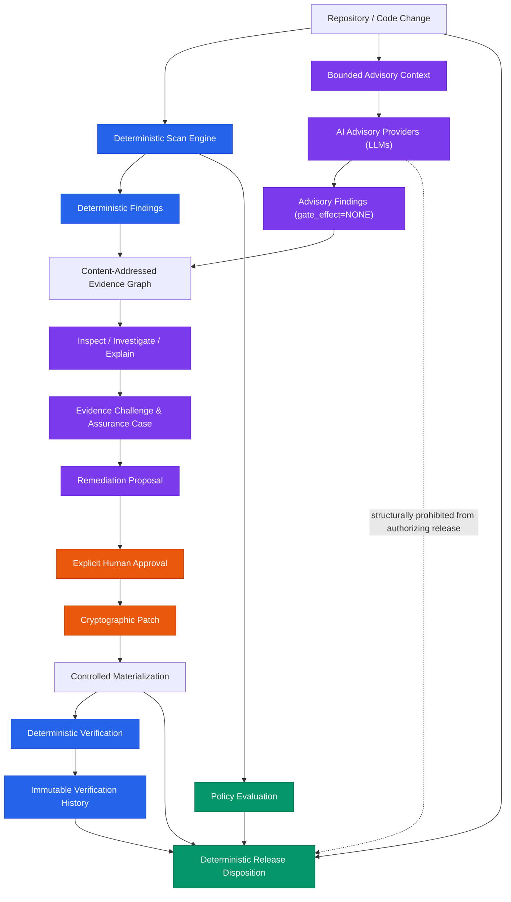

<div align="center">

# Preflight

### AI-Assisted Security Review &bull; Deterministic Release Confidence

[](https://pypi.org/project/before-deploy/)
[](https://www.python.org/)
[](https://github.com/haytamAroui/preflight/actions/workflows/ci.yml)
[](https://github.com/haytamAroui/preflight/actions/workflows/release.yml)
[](LICENSE)
[](docs/RELEASE_DISPOSITION.md)
[](docs/ADVISORY_REVIEW_PLANE.md)

<p align="center">
  <strong>Preflight</strong> is a security assurance platform and deterministic release gate engineered for teams building and shipping AI-generated and AI-assisted software.
</p>

> **"AI can discover. Humans can approve. Preflight decides from deterministic evidence."**

Preflight is built to answer one critical release question:  
**Are we ready to ship this exact code, backed by reproducible, tamper-proof evidence?**

[Quickstart](#-quickstart) &bull;
[Key Features](#-key-features) &bull;
[Architecture](#-architecture) &bull;
[Lifecycle Workflow](#-from-scan-to-release-evidence) &bull;
[MCP & Agent Integration](#-mcp--agent-integration) &bull;
[Documentation](#-documentation)

---

</div>

## 💡 Why Preflight?

Modern engineering teams increasingly rely on LLMs and autonomous coding agents to author code. However, delegating software release authority to probabilistic AI introduces unpredictable gates, hallucinated assurances, and unverified security risks.

Preflight bridges this gap by decoupling **exploratory discovery** from **release authority**:

| Dimension | Autonomous AI Agents | Traditional Static Scanners | Preflight |
| :--- | :--- | :--- | :--- |
| **Exploration & Context** | High (deep semantic reasoning) | Low (rigid pattern matching) | **Best of both**: AI-assisted deep investigation |
| **Release Decision** | Probabilistic (unreliable gate) | Deterministic (noisy / rigid) | **Strictly Deterministic** (based on immutable evidence) |
| **Evidence Lineage** | None (chat logs / transient diffs) | Local report files | **Content-addressed Evidence Graph** |
| **Remediation** | Autonomous, unsupervised edits | Manual developer patching | **Human-governed proposals & verified patches** |
| **Safety Invariant** | AI decides if code is safe | Tool flags errors | **AI is structurally prohibited from granting release** |

---

## ⚡ Quickstart

### 1. Instant Run via `uvx` or `pipx` (Zero Install)

Run a deterministic security scan against your repository right now without installing anything:

```bash
# Using uvx (recommended)
uvx --from before-deploy preflight scan .

# Or using pipx
pipx run --spec before-deploy preflight scan .
```

### 2. Package Installation

Install via PyPI using your favorite package manager:

```bash
# Using uv
uv add --dev before-deploy

# Using pip
pip install before-deploy
```

> **CLI alias note:** The CLI is available under both `preflight` (recommended) and `before-deploy` (backwards-compatible alias).

### 3. GitHub Actions CI/CD Integration

Enforce a deterministic security gate in your deployment pipeline:

```yaml
name: Preflight Security Gate

on:
  pull_request:
  push:
    branches: [main, master]

jobs:
  security-gate:
    runs-on: ubuntu-latest
    steps:
      - name: Checkout repository
        uses: actions/checkout@v4

      - name: Set up Python
        uses: actions/setup-python@v5
        with:
          python-version: "3.11"

      - name: Install Preflight
        run: pip install before-deploy

      - name: Run Deterministic Security Gate
        run: |
          preflight scan . \
            --policy rules/strict-ci-policy.yaml \
            --output-dir reports/security-gate

      - name: Upload Security Findings (SARIF)
        if: always()
        uses: github/codeql-action/upload-sarif@v3
        with:
          sarif_file: reports/security-gate/report.sarif
```

### 4. Pre-commit Hook

Add Preflight to your `.pre-commit-config.yaml`:

```yaml
repos:
  - repo: https://github.com/haytamAroui/preflight
    rev: v1.0.0
    hooks:
      - id: preflight
```

---

## 🎯 Key Features

### 🛡️ Deterministic Security Gate
- **Adaptive Project Profiling**: Automatically senses language ecosystems, web frameworks, API boundaries, and sensitive data paths.
- **Fail-Closed Policy Engine**: Deterministic policy evaluation with explicit waiver governance and granular exit codes.
- **Universal Evidence Outputs**: Generates comprehensive artifacts in `report.json`, human-readable `report.md`, and industry-standard `report.sarif`.

### 🧠 Bounded AI Advisory Plane
- **Multi-Model Support**: Leverage state-of-the-art models (OpenAI, Claude, open models via OpenCodeReview) for deep contextual inspection.
- **Architectural Isolation**: Advisory findings are structurally tagged with `gate_effect=NONE`. AI recommendations can corroborate and advise, but **never** override deterministic policy.
- **Evidence Challenges**: Formal reasoning mechanisms evaluating claims as `SUPPORTED`, `INSUFFICIENT`, `CONTRADICTED`, or `UNRESOLVED`.

### 🔗 Content-Addressed Evidence Graph
- **Immutable Lineage**: Every scan, finding, review claim, human approval, and regression test is cryptographically linked.
- **Traceable Assurance Cases**: Connect high-level security claims directly to source code revisions and test executions.

### 👥 Human-in-the-Loop Remediation
- **Explicit Human Approval**: AI can propose a remediation patch with citations, but only a human can authorize its materialization.
- **Controlled Materialization**: Verifies exact patch applications and produces regression evidence to verify fixes before shipping.

---

## 🏗️ Architecture



> **Enforced Safety Boundary**: The release engine strictly prohibits advisory data from participating in `ReleaseDisposition`. Our continuous integration suite executes architectural boundary tests (`tests/unit/test_architecture_boundary.py`) that verify the deterministic core cannot import the advisory plane.

---

## 🔄 From Scan to Release Evidence

Preflight is a complete release-readiness platform providing a linear, auditable sequence of operations:

```
scan ──▶ review ──▶ inspect ──▶ investigate ──▶ explain ──▶ propose ──▶ approve ──▶ fix ──▶ regress ──▶ verify ──▶ history ──▶ release
```

| Step | Command | Description | Authority Level |
|---|---|---|---|
| **1. Scan** | `preflight scan .` | Deterministic security rule & policy check | Deterministic Engine |
| **2. Review** | `preflight review .` | Corroborates static findings with advisory AI analysis | Non-authoritative (`gate_effect=NONE`) |
| **3. Inspect** | `preflight inspect <id>` | Dumps full cryptographic evidence for a finding | Read-Only Lineage |
| **4. Investigate** | `preflight investigate` | Bounded diagnostic context gathering | Advisory Plane |
| **5. Explain** | `preflight explain` | Generates cited explanation of risk mechanics | Advisory Plane |
| **6. Propose** | `preflight propose` | Generates candidate remediation patch | Advisory Plane |
| **7. Approve** | `preflight approve <id>` | Human reviews proposal and signs authorization | **Explicit Human Authority** |
| **8. Fix** | `preflight fix` | Materializes content-addressed patch safely | Controlled Workspace Action |
| **9. Regress** | `preflight regress` | Validates patch does not cause functional regressions | Deterministic Test Suite |
| **10. Verify** | `preflight verify` | Proves the specific vulnerability is closed | Deterministic Verification |
| **11. History** | `preflight history` | Appends record to immutable audit ledger | Cryptographic Ledger |
| **12. Release** | `preflight release` | Issues final verdict: `READY`, `HOLD`, `BLOCK`, `ERROR` | **Authoritative Deterministic Gate** |

---

## 🌐 MCP & Agent Integration

Preflight provides a native [Model Context Protocol (MCP)](https://modelcontextprotocol.io/) server (`preflight-mcp`), allowing AI coding assistants to leverage Preflight's diagnostic and verification tools within strict safety boundaries.

### Zero-Installation Run with `uvx`
Launch the server without manual installation:

```bash
uvx --from before-deploy preflight-mcp
```

### Agent Configuration

Add Preflight to your agent or IDE config (e.g., Claude Desktop, Cursor, Antigravity, Windsurf):

```json
{
  "mcpServers": {
    "preflight": {
      "command": "uvx",
      "args": ["--from", "before-deploy", "preflight-mcp"]
    }
  }
}
```

> **Security Sandbox by Design**: The MCP server exposes inspection, diagnostic, and verification tools to your agent, but deliberately **withholds** human approval, autonomous patch generation, and unconfirmed workspace writes.

### Thin Clients & Skills
- **Claude Code**: Native delegation client available in [`clients/claude-code/`](clients/claude-code/README.md).
- **Codex / Antigravity Skill**: Pre-configured workflow skill under [`.agents/skills/before-deploy-assure/`](.agents/skills/before-deploy-assure/SKILL.md).

---

## 🛡️ Security Domain Coverage

Preflight features a modular capability registry with specialized controls across multiple languages and ecosystems:

| Ecosystem / Domain | Covered Security Controls & Detectors |
| :--- | :--- |
| **Python / FastAPI** | Auth/AuthZ markers, SSRF vectors, SQL Injection, Command Injection, JWT verification bypasses, Unsafe file uploads, CORS misconfigurations, Sensitive data in logs |
| **TypeScript / Next.js** | Server Action boundaries, SSRF vulnerabilities, Secret exposure in client bundles (`NEXT_PUBLIC_*`), Route error disclosure, Wildcard CORS |
| **Java / Spring** | Spring Security `.permitAll()` misconfigurations, Actuator endpoint exposure, Credentialed wildcard CORS, JPA native SQL injection |
| **Go** | Insecure TLS configurations, Module checksum verification, Known dependency vulnerabilities, Optional Gosec adapter |
| **Infrastructure & CI** | Dockerfile best practices, GitHub Actions workflow permissions & SHA pinning, Compose privileged services, Terraform configuration security |
| **Supply Chain** | Multi-ecosystem lockfile validation (Python, Node.js, Go, Rust, Ruby, PHP), SBOM generation, Artifact provenance |

---

## 🚦 Policy Outcomes & Disposition

### Policy Evaluation Exit Codes

| Status | Exit Code | Description |
|---|:---:|---|
| `PASS` | `0` | All applicable security controls passed with no blocking issues |
| `NOT_EVALUATED` | `0` | No controls applied to the targeted scope |
| `BLOCK` | `10` | One or more blocking security violations found |
| `WAIVER_REQUIRED` | `11` | Blocking violation requires an active, approved waiver |
| `ERROR` | `20` | Runtime execution error, missing evidence, or invalid configuration |

### Final Release Dispositions

| Disposition | Meaning | Condition |
|---|---|---|
| **`READY`** | **Authorized to Ship** | All deterministic policy requirements and verification milestones are fully met. |
| **`HOLD`** | **Release Paused** | Required evidence is incomplete, stale, drifted, or active under temporary waiver. |
| **`BLOCK`** | **Release Prohibited** | Deterministic policy failed or latest verification failed. |
| **`ERROR`** | **Evaluation Failure** | Authoritative gate could not evaluate required inputs safely. |

---

## 📚 Documentation

Detailed architectural specifications, schemas, and design docs:

- **Core Authority & Architecture**:
  - [Deterministic Release Disposition (`docs/RELEASE_DISPOSITION.md`)](docs/RELEASE_DISPOSITION.md)
  - [Advisory Review Plane (`docs/ADVISORY_REVIEW_PLANE.md`)](docs/ADVISORY_REVIEW_PLANE.md)
  - [Production Readiness Criteria (`docs/PRODUCTION_READINESS_CRITERIA.md`)](docs/PRODUCTION_READINESS_CRITERIA.md)
- **Controls & Profiling**:
  - [Control Catalog (`docs/CONTROL_CATALOG.md`)](docs/CONTROL_CATALOG.md)
  - [Security Domain Catalog (`docs/SECURITY_DOMAIN_CONTROL_CATALOG.md`)](docs/SECURITY_DOMAIN_CONTROL_CATALOG.md)
  - [Adaptive Project Profiling (`docs/ADAPTIVE_PROJECT_PROFILING.md`)](docs/ADAPTIVE_PROJECT_PROFILING.md)
- **Evidence & Remediation**:
  - [Evidence Graph Specification (`docs/EVIDENCE_GRAPH.md`)](docs/EVIDENCE_GRAPH.md)
  - [Evidence Correlation & Corroboration (`docs/EVIDENCE_CORRELATION.md`)](docs/EVIDENCE_CORRELATION.md)
  - [Human Approval & Content-Addressed Patches (`docs/HUMAN_APPROVAL_PATCH.md`)](docs/HUMAN_APPROVAL_PATCH.md)
  - [Verification & History Tracking (`docs/VERIFICATION_HISTORY.md`)](docs/VERIFICATION_HISTORY.md)
- **Integrations & Protocols**:
  - [MCP API Surface Specification (`docs/MCP_API_SURFACE.md`)](docs/MCP_API_SURFACE.md)
  - [Claude Code Thin Client (`docs/CLAUDE_THIN_CLIENT.md`)](docs/CLAUDE_THIN_CLIENT.md)
  - [Codex Thin Client (`docs/CODEX_THIN_CLIENT.md`)](docs/CODEX_THIN_CLIENT.md)

---

## ⚖️ License

Distributed under the MIT License. See [`LICENSE`](LICENSE) for details.
